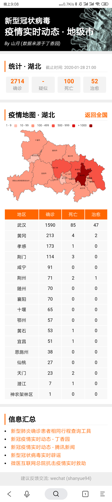

# 新型冠状病毒疫情实时动态省市地图

> 武汉加油，众志成城，共抗疫情

最近所有人的注意力都集中在武汉的疫情上，在 [丁香园肺炎疫情实时动态](https://3g.dxy.cn/newh5/view/pneumonia?from=timeline) 中提供了疫情地图及实时权威新闻，但其中并没有省市地图。

我在每天闭门不出为国家做贡献的同时，对疫情地图做了简单的扩展，能够显示某个省的疫情以及消息播报，旨在帮助大家更加直观了解自己家乡的情况。最后提醒大家尽量不出门，出门后必戴口罩。

## Todo

> **目前打包后加载总体积 gzip 后小于 300KB，每次自动部署时间平均在一分半左右**

+ [x] 需求，使用脚本自动拉取丁香园的最新数据
+ [x] 部署，添加 CICD，每半个小时部署一次 (github actions)
+ [x] 优化，配置 cdn/https/http2，优化网站加载速度
+ [x] 需求，添加省级地图
+ [x] 优化部署策略，避免白屏问题
+ [x] 添加信息汇总
+ [x] 优化打包策略，对首屏地图组件进行按需加载，加速首屏速度
+ [x] 运营，对省级信息生成独立路由，便于分享及传播
+ [x] Bugfix，修复中国各省市地级市简称与全称对应关系，如恩施，阿坝，西双版纳等
+ [x] Bugfix，修复湖北天门，潜江，仙桃为县级市的问题
+ [x] Bugfix，修复西藏，重庆多拼音问题
+ [x] Bugfix，修复客户端路由不匹配首页路径时的404行为，在微信浏览器中可能会遇到问题 (使用 alicdn rewrite 解决)
+ [x] Bugfix，解决 swr 带来的 Request Queue 时间过长的问题
+ [x] 需求，添加实时播报以及省级的实时播报
+ [x] 优化打包策略，由于丁香园数据常变，对丁香园数据抽离打包，强化永久缓存并加速部署时间
+ [x] 优化，添加 webpack bundle analyze
+ [x] 优化打包策略，对 echarts 各组件进行按需加载 (目前 gzip 后总体积不超过 200KB)
+ [x] 优化打包粗略，对 echarts 中省级地图数据进行按需加载
+ [x] 优化，压缩首图，优化网站加载速度
+ [x] 优化部署策略，对 OSS 上静态资源增量(以前是全量)配置永久缓存，加速部署时间
+ [x] 优化部署策略，对 OSS 上静态资源增量传输（类似 rsync），加速部署时间
+ [ ] 优化部署策略，重复利用 npm cache，加快 npm install 速度
+ [ ] 优化部署/打包策略，加快 npm run build 速度
+ [ ] 运营，分享时生成图片，利于分享及传播
+ [ ] 运营，添加微信分享的 API

## 快速开始

``` bash
# 获取数据
$ node scripts/build-origin.js

$ npm start
```

## 部署

使用 `github actions` 与 `alioss` 自动部署，使用 `github actions` 的定时任务每半个小时部署一次(为了获取最新数据)。

关于部署可以参考以下两篇文章

+ [使用 AliOSS 部署及加速你的静态网站](https://github.com/shfshanyue/you-dont-need-vps/blob/master/deploy-fe-with-alioss.md)
+ [github actions 持续集成简介及实践](https://github.com/shfshanyue/you-dont-need-vps/blob/master/github-action-guide.md)

## 数据来源

数据爬自丁香园，使用脚本 `build-origin.js` 获取数据。数据每半个小时爬取一次，直接注入到前端，因此对丁香园造成的压力很小。

另外，如果你需要更详细的数据，可以参考项目 [BlankerL/DXY-2019-nCoV-Crawler](https://github.com/BlankerL/DXY-2019-nCoV-Crawler)。

## 截图



