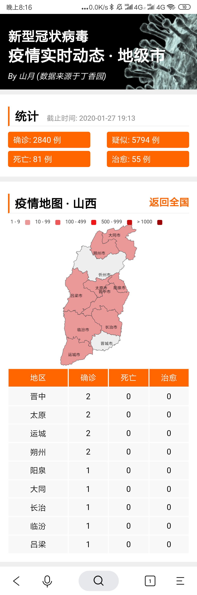

# 肺炎疫情地图 | 地级市

> 众志成城，共抗疫情

由于 [丁香园肺炎疫情实时动态](https://3g.dxy.cn/newh5/view/pneumonia?from=timeline) 中不含有各省份疫情地图，于是做了相关扩展



## 快速开始

``` bash
# 获取数据
$ node build-origin.js

$ npm start
```

## 数据来源

数据爬自丁香园，使用脚本 `build-origin.js` 获取数据

## 部署

使用 `github-actions` 自动部署，每半个小时部署一次(为了获取最新数据)，部署在阿里云的 OSS 上。
